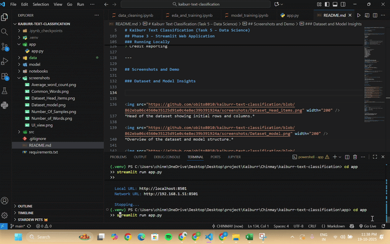

Here’s a **professional and clean README** with placeholders for your **7 screenshots** and **1 main GIF**, including concise descriptions. Screenshots are shown small, and the GIF prominently to illustrate the working app.

---

# Kaiburr Text Classification (Task 5 – Data Science)

**Candidate:** Chinmay Saseendran
**Submission Date:** October 20, 2025

---

## Project Overview

This project was developed as part of the **Kaiburr Recruitment Assessment (Task 5 – Data Science)**.
The objective is to build a machine learning model that classifies **consumer complaint texts** into one of four categories.

**Categories:**

1. Credit Reporting
2. Debt Collection
3. Consumer Loan
4. Mortgage

---

## Project Phases

| Phase                 | Description                                                    | Status    |
| --------------------- | -------------------------------------------------------------- | --------- |
| **1. Setup**          | Initialized project structure, environment, and Git repository | Completed |
| **2. Data Cleaning**  | Processed and balanced dataset (≈20k rows, 5k per class)       | Completed |
| **3. Model Training** | Trained and compared multiple ML models                        | Completed |
| **4. Streamlit App**  | Deployed best-performing model for live predictions            | Completed |

---

## Project Structure

```
kaiburr-text-classification/
│
├── app/
│   └── app.py
├── data/
│   └── consumer_complaints_sample_balanced.csv
├── model/
│   ├── logistic_regression_model.pkl
│   └── tfidf_vectorizer.pkl
├── notebooks/
│   ├── data_cleaning.ipynb
│   ├── eda_analysis.ipynb
│   └── model_training.ipynb
├── screenshots/
│   ├── dataset_head.png
│   ├── dataset_model.png
│   ├── number_of_samples.png
│   ├── number_of_words.png
│   ├── average_word_count.png
│   ├── common_words.png
│   ├── ui_view.png
│   └── working_demo.gif
├── README.md
├── requirements.txt
└── .gitignore
```

---

## Phase 1 – Data Cleaning

* Processed a large consumer complaints dataset in chunks
* Extracted and filtered the top four complaint categories
* Balanced each class to **5,000 samples** (20,000 total)
* Saved the cleaned dataset as `consumer_complaints_sample_balanced.csv`

**Tools:** pandas, numpy
**Techniques:** text preprocessing, sampling, data balancing

---

## Phase 2 – Model Training and Evaluation

| Model               | Accuracy  |
| ------------------- | --------- |
| Logistic Regression | **88.2%** |
| Naive Bayes         | 84.7%     |
| Random Forest       | 80.1%     |

**Best Model:** Logistic Regression using TF-IDF features
**Vectorizer:** TF-IDF (`max_features=5000`, including bigrams)
**Saved Artifacts:**

* `/model/tfidf_vectorizer.pkl`
* `/model/logistic_regression_model.pkl`

**Highlights:**

* Logistic Regression achieved **88.2% accuracy**, making it the most reliable for this classification task.
* Evaluation included confusion matrix and model comparison charts.

---

## Phase 3 – Streamlit Web Application

### Running Locally

```bash
cd app
streamlit run app.py
```

Then open **[http://localhost:8501](http://localhost:8501)** in your browser.

**Features:**

* Accepts a consumer complaint text as input
* Predicts one of four categories in real time
* Displays model confidence and relevant details

**Example Input:**

> "I found incorrect information on my credit report and the company refused to fix it."

**Predicted Output:**

> Credit Reporting

---

## Screenshots and Demo

### Dataset and Model Insights


  
*Head of the dataset showing initial rows and columns.*

  
*Overview of the dataset and model structure.*

  
*Number of samples per category after balancing.*

  
*Total number of words in the dataset.*

  
*Average word count per complaint.*

  
*Most frequent words in each category.*

  
*UI view of the Streamlit app.*

</div>

---

### Demo of Working App

<div align="center">

  
*Animated demonstration showing how the app accepts text input and provides category predictions in real time.*

</div>

---

## Technologies Used

| Category          | Tools                                                                         |
| ----------------- | ----------------------------------------------------------------------------- |
| **Language**      | Python 3.10                                                                   |
| **Libraries**     | pandas, scikit-learn, matplotlib, seaborn, nltk, joblib, wordcloud, streamlit |
| **Modeling**      | TF-IDF + Logistic Regression                                                  |
| **Visualization** | Matplotlib, Seaborn, WordCloud                                                |
| **Deployment**    | Streamlit                                                                     |

---

## Future Enhancements

* Tune Logistic Regression hyperparameters for better accuracy
* Experiment with transformer-based embeddings (e.g., BERT)
* Deploy the app on Streamlit Cloud or Hugging Face Spaces
* Integrate live complaint data through an API

---

## Final Remarks

This project demonstrates the full data science workflow — from **data preprocessing** and **model training** to **web deployment**.

**Final Model Accuracy:** 88.2%
**Best Model:** Logistic Regression (TF-IDF)

---

If you want, I can **also adjust the layout so all screenshots are neatly in a 2-row grid** with captions — it looks more professional on GitHub instead of one row.

Do you want me to do that?
